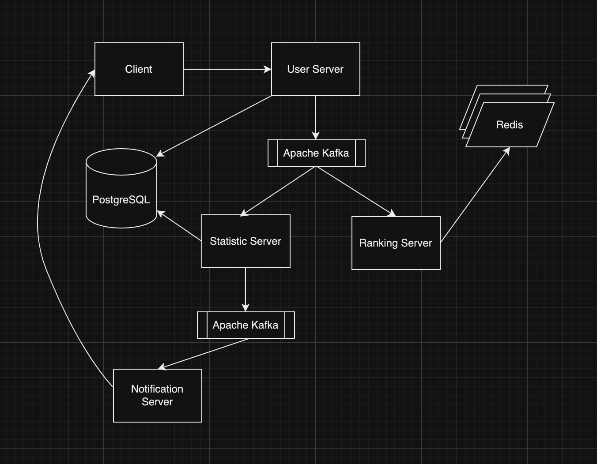

# kafka-redis-ranking


## Description

- This project is a simple example of how to use Kafka and Redis to rank messages.
- `publish-subscribe` implement the model
- Assume that multiple services are distributed (this project is written docker-compose for simplicity)
---


## Development Environment

- Java 17
- Spring Boot 3.2.4
- Apache Kafka
- redis, postgreSQL
- docker, docker-compose
---


## Structure

this picture is real structure of this project
 


---


## How to run

```angular2html
cd /path/to/project

./gradlew build -x test

docker-compose up --build
```
---


## Notice

- this project is `requesting api automatic by using UserTestRunner class` so If you don't want it, please delete the class.
- if you want to test, you can edit UserTestRunner class
---


## Reference Links

- [Kafka](https://kafka.apache.org/)
- [Redis](https://redis.io/docs/latest/develop/use/)
- [ChatGPT](https://chat.openai.com/)
